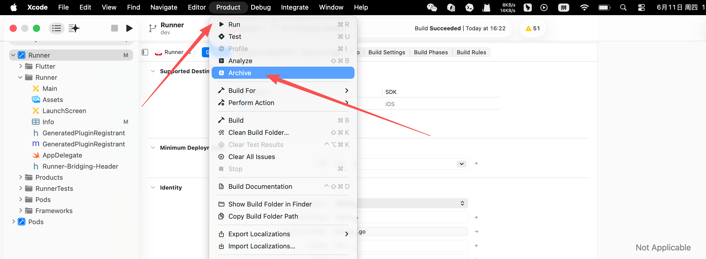
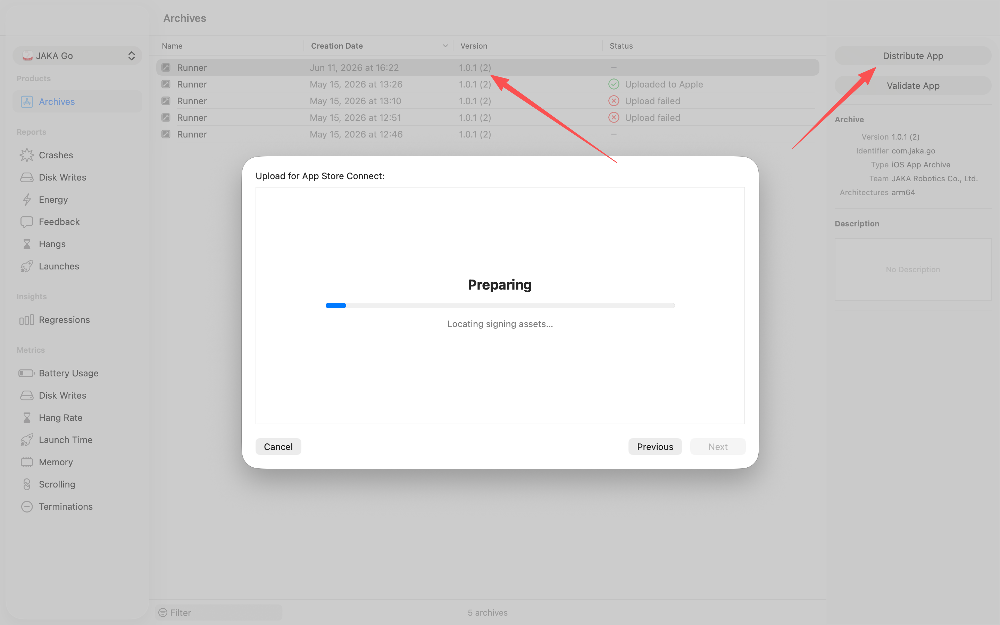

1. 打包安卓api

```bash
# 打生产包
flutter build apk --release

# 打debug包
flutter build apk --debug

# 输出目录
# build/app/outputs/flutter-apk/app-release.apk
```


2. 打包测试的ios ipa
```bash
 flutter build ipa
 flutter build ipa --release
```

归档


上传



在mac上安装 Apple Configurator
手机连接mac电脑
将打包后的 ipa 拖拽到手机中


注意：可能签名有问题

3. 
```bash
# 查看设备列表
xcrun xctrace list devices
flutter devices

# 真机运行app
flutter run --release -d 00008140-000E41210A6A801C
```


4. 打包web / exe
flutter build web --release
flutter build windows --release