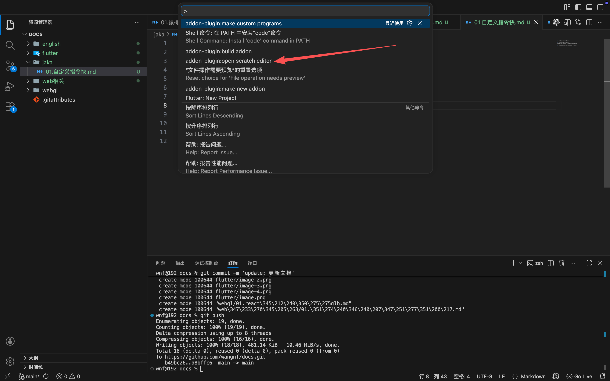
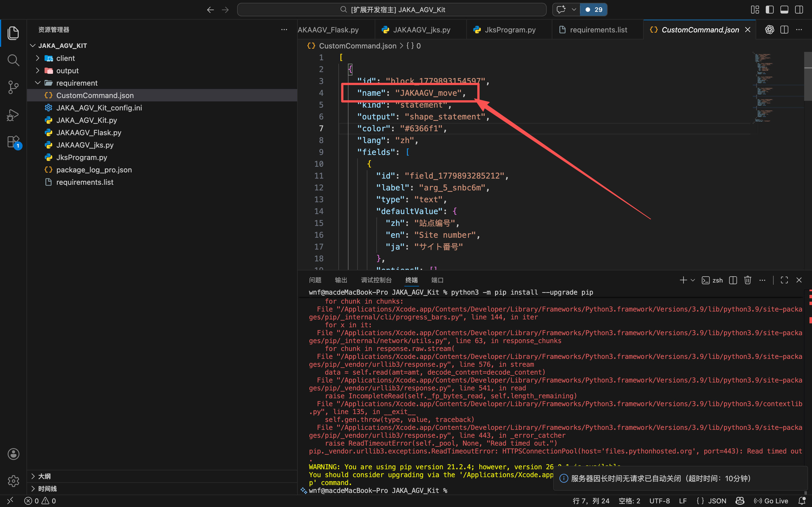
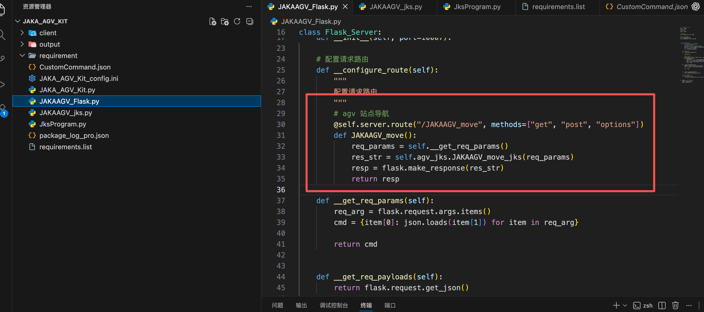

1. 打开jaka-addon-plugin项目
这个项目是vscode插件项目

进入 ./web-source 执行
```bash
npm i
npm run build
```

在根目录执行
```bash
npm run compile
```

在项目内按F5打开调试模式
调试模式打开，就相当于在vscode中安装了这个插件


2. 在 JAKA_AGV_Kit 项目中按 command + shift + P


生成自定义指令块的 json, 名字对应webapp中的jksurl "connected_robot/{}"


3. 在项目中配置flash，api路由的名字对应自定义指令块的名字



4. 安装离线包
```bash
pip3 install --no-index --find-links=./requirement -r requirements.list
```
注意：addon包中的库 都是 linux下的库