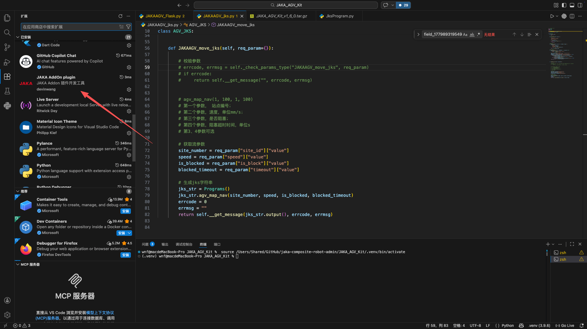
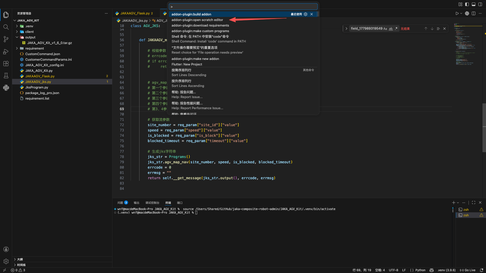
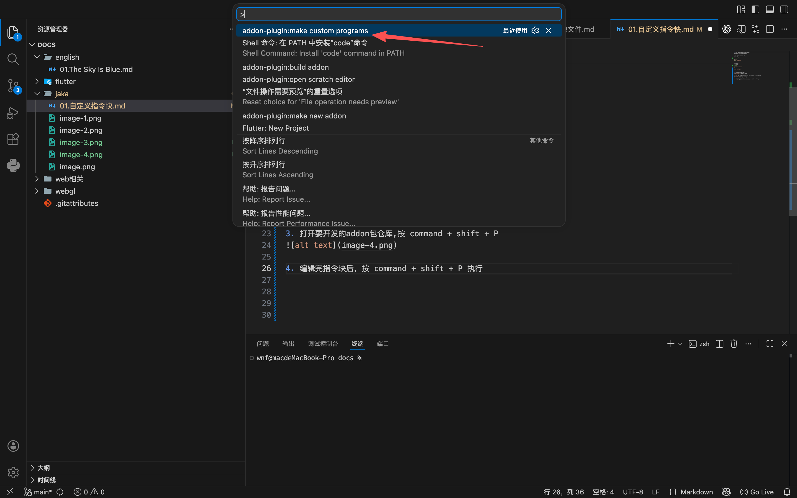

1. 打开jaka-addon-plugin项目
这个项目是vscode插件项目

进入 ./web-source 执行
```bash
# web打包
npm i
npm run build
```

在根目录执行
```bash
# 编译
npm run compile
# 打包
vsce package
```

2. 安装打包好的插件


3. 打开要开发的addon包仓库,按 command + shift + P


4. 编辑完指令块后，按 command + shift + P 执行


5. 最后执行 build


